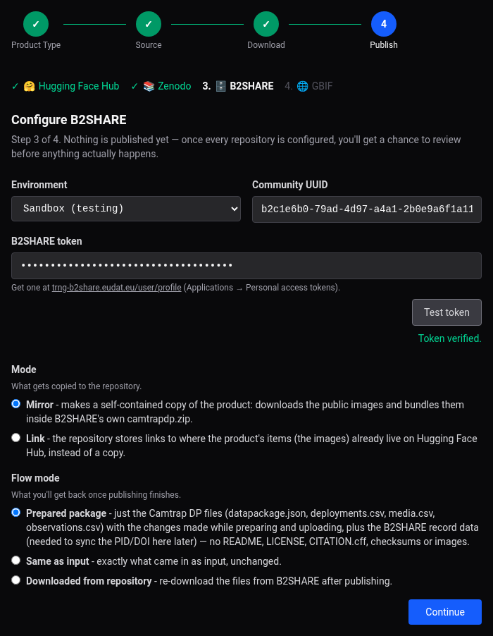
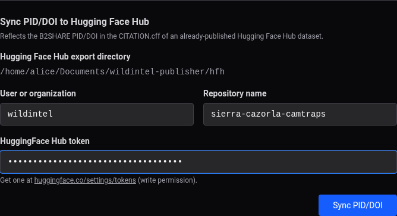

# Web App User Guide — B2SHARE

!!! note
    See [Publishing to B2SHARE](publishing-b2share.md) for what this repository is and
    what ends up stored there.

Every time you publish a product to B2SHARE, a page similar to this one appears, asking
you to fill in the following fields:

## Fields

- **Environment** — **Sandbox** (`trng-b2share.eudat.eu`, testing) or **Production**
  (`b2share.eudat.eu`).
- **Community UUID** — the EUDAT community this record belongs to; find it on the
  community's own B2SHARE page.
- **B2SHARE token** — get one at the URL shown under the field, under *Applications →
  Personal access tokens* (varies with environment). Leave blank to reuse a previously
  saved token. **Test token** verifies it immediately.
- **Mode** — **Mirror** (default) downloads the public images and bundles them inside
  B2SHARE's own `camtrapdp.zip` (self-contained — B2SHARE caps each record at 100 files,
  so images can't be uploaded loose). **Link** doesn't download anything — the repository
  stores links to where the images already live on Hugging Face Hub instead (only
  meaningful if Hugging Face Hub precedes B2SHARE in the publish order).
    - For Camtrap DP in **Mirror** mode, a **Resize images to fit the archive size
      limit** checkbox appears (checked by default) — if the downloaded images would
      push `camtrapdp.zip` over B2SHARE's own 20 GiB per-file upload cap, they're all
      downscaled uniformly (same scale for every image, computed once) before bundling.
      **Archive size limit (GiB)** overrides that cap (leave blank for the real 20 GiB
      one), and **Minimum image edge (px)** sets the floor an image's longest edge is
      never shrunk below (640px by default) — past that point, publishing fails with a
      clear error instead of silently producing an unusable image or a still-oversized
      zip. See [Zenodo — Camtrap
      DP](publishing-zenodo-camtrapdp.md#keeping-camtrapdpzip-under-zenodos-own-size-limit),
      which B2SHARE mirrors here with its own (lower) real cap.
- **Flow mode** — what you get back once publishing finishes, only relevant if another
  repository comes after this one in the publish order: the **prepared** package plus the
  B2SHARE record data needed to sync the PID/DOI later (default), the **same as input**
  unchanged, or a fresh copy **downloaded from** B2SHARE itself.

Unlike Zenodo, B2SHARE only *submits* the record for moderator review — its PID/DOI may
not be known yet once the wizard finishes (see the "When it's done" step of the
[Software Application](guide-web-software.md#7-when-its-done) or
[AI Dataset](guide-web-yolo.md#8-when-its-done) walkthrough).

## Sync PID/DOI to Hugging Face Hub

If you publish B2SHARE separately from Hugging Face Hub (a different wizard run, or later
after Hugging Face Hub was already published on its own — including once a pending
moderator review finally resolves), this section — shown on the final "All done!" screen
once B2SHARE has published — reflects the B2SHARE PID/DOI into the `CITATION.cff` of an
*already-published* Hugging Face Hub export, and re-uploads just that changed file (plus
`checksums-sha256.txt`).

- **Hugging Face Hub export directory** — read-only, taken from `settings.toml`.
- **User or organization** — pre-filled from `settings.toml`, same as the Hugging Face
  Hub form itself.
- **Repository name** — **never pre-filled** — the dataset name is specific to each
  product, not something worth remembering globally, so type it in each time.
- **HuggingFace Hub token** — leave blank to reuse a previously saved one.

Once synced, it confirms with a direct link to the Hugging Face Hub dataset (or, if no
PID/DOI is available on B2SHARE yet, a note to try again once the record is approved):

This is the web equivalent of the CLI's `b2share sync-pid` — except the CLI only edits
the local `CITATION.cff` and tells you to re-run `hfh upload` yourself; here the
re-upload happens automatically.
