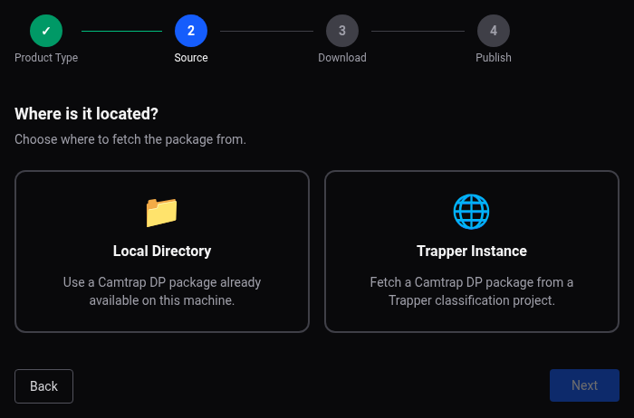
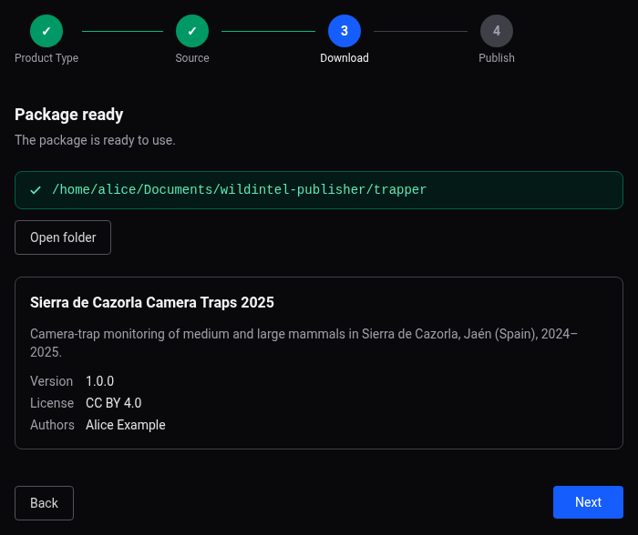
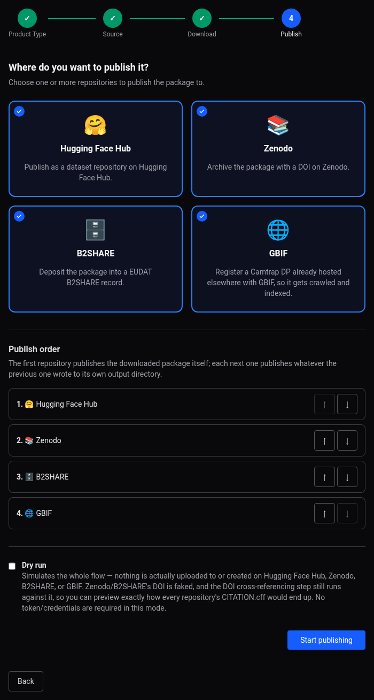
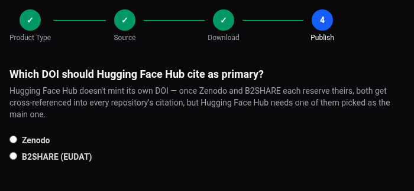
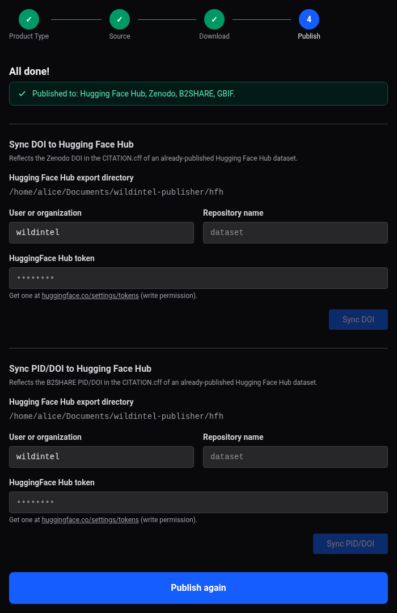

# Web App User Guide — Camtrap DP

A step-by-step walkthrough of publishing a Camtrap DP package using the web app's wizard —
screen by screen, with no commands involved. See the [Publishing
Guide](publishing-guide.md) for the concepts referenced along the way (media modes,
locking, the generic pipeline). Before starting, make sure every repository account you
plan to use is ready — see [Before you start](guide-web.md#before-you-start).

---

## 1. Choose what to publish

On the wizard's first screen, pick **Camtrap DP**.

## 2. Choose where it comes from

Pick **Trapper Instance** to fetch a package from a Trapper classification project, or
**Local Directory** if you already have one on this machine.

## 3. Confirm the package and its description

Once the package is ready (downloaded, or already local), the wizard shows where it
lives. If its common description is missing something required (title, description,
version, license, authors), a form prompts for exactly what's missing; once complete, a
summary card shows the title, version, license, authors, and homepage.

## 4. Choose repositories and publish order

Select one or more of **Hugging Face Hub**, **Zenodo**, **B2SHARE**, and **GBIF** — GBIF
is only offered for Camtrap DP, see [Publishing to
GBIF](publishing-gbif.md#4-what-can-i-publish-here). If you select more than one, a
**publish order** list lets you reorder them: the first repository publishes the fetched
package itself, and each next one publishes whatever the previous one wrote to its own
output — so, for example, publishing to Hugging Face Hub before Zenodo lets Zenodo's
record link back to it. GBIF doesn't take part in this chaining (it never hosts a copy of
the package), but ordering it after whichever repository will host the package lets its
own configuration form prefill the archive URL automatically (see
[GBIF](guide-web-gbif.md)).

## 5. Configure each selected repository

The wizard walks through your selected repositories one at a time, each with its own
configuration form — see that repository's own page for the full form, field-by-field,
with a screenshot: [Hugging Face Hub](guide-web-hfh.md), [Zenodo](guide-web-zenodo.md),
[B2SHARE](guide-web-b2share.md), [GBIF](guide-web-gbif.md).

## 6. Choose the primary DOI (only if HFH, Zenodo and B2SHARE are all selected)

If Hugging Face Hub, Zenodo, and B2SHARE are all selected together, you're asked which
of Zenodo's or B2SHARE's DOI should be treated as *primary* in Hugging Face Hub's own
citation file — Hugging Face Hub never has a DOI of its own, so this only comes up when
there's more than one candidate to choose from.

## 7. Confirm and publish

After a final summary screen, **Publish** runs the whole sequence on its own: uploading
to every selected repository, cross-referencing whatever DOIs Zenodo/B2SHARE obtained
into each other's (and Hugging Face Hub's) citation file, then locking each repository —
with a single live progress view showing every repository's status as it goes. GBIF has
no upload/lock of its own to speak of — it's registered with a single Registry API call
during this same automated sequence, using the archive URL from step 5 (see [Publishing
to GBIF](publishing-gbif.md#2-main-characteristics)).

## 8. When it's done

The wizard confirms which repositories were published, but doesn't print each one's
resulting URL/DOI/PID directly on this screen — check the repository itself, or the
record file its own output directory holds (`zenodo_record.json`,
`b2share_record.json`, `gbif_linked_dataset_record.json`). If Zenodo and/or B2SHARE were
published, you can also use the **Sync DOI**/**Sync PID** sections shown here — besides
reflecting the DOI/PID into an already-published Hugging Face Hub export, they confirm
success with a direct link back to it (see [Zenodo](guide-web-zenodo.md#sync-doi-to-hugging-face-hub)/
[B2SHARE](guide-web-b2share.md#sync-piddoi-to-hugging-face-hub)). If B2SHARE is still
pending moderator review, that's shown too — its final PID/DOI won't be known until a
moderator approves the submission, which happens outside this wizard run.
