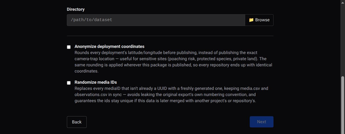
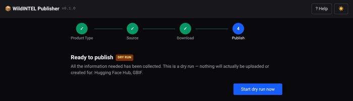

# Web App User Guide — Camtrap DP

The `wildintel-publisher` web app makes it easy to publish a Camtrap DP package — a
step-by-step wizard, screen by screen, with no commands involved. See the [Publishing
Guide](publishing-guide.md) for the concepts referenced along the way (media modes,
locking, the generic pipeline). Before starting, make sure every repository account you
plan to use is ready — see [Before you start](guide-web.md#before-you-start).

---

## 1. Choose what to publish

On the wizard's first screen, pick **Camtrap DP**.

## 2. Choose where it comes from

Pick **Trapper Instance** to fetch a package from a Trapper classification project,
**Local Directory** if you already have one on this machine, or **Public URL** to fetch
an already-published Camtrap DP zip archive from a public URL (validated against the
official schema on the way in — the same URL is then reusable as-is for
[GBIF](publishing-gbif.md)'s own archive URL, since it's already confirmed public).

Once a source is picked, two optional preprocessing settings appear below it — both off
by default, applied once (right as the package's common description is generated), and
safe to leave unchecked if neither concern applies to your dataset:

- **Anonymize deployment coordinates** — rounds every deployment's latitude/longitude
  before publishing, useful for sensitive sites (poaching risk, protected species,
  private land).
- **Randomize media IDs** — replaces every `mediaID` that isn't already a UUID with a
  freshly generated one, keeping `media.csv`/`observations.csv` in sync — guards against
  leaking the original export's own numbering convention, and keeps ids collision-free if
  this data is later merged elsewhere.

## 3. Confirm the package and its description

Once the package is ready (downloaded, or already local), the wizard shows where it
lives. If its common description is missing something required (title, description,
version, license, authors), a form prompts for exactly what's missing; once complete, a
summary card shows the title, version, license, authors, and homepage.

## 4. Choose repositories and publish order

For Camtrap DP, the wizard only offers **Hugging Face Hub** and **GBIF** (Zenodo/B2SHARE
stay available for it via the CLI only). **GBIF is mandatory** here — pre-selected and
not deselectable, so a Camtrap DP dataset always ends up registered with GBIF; Hugging
Face Hub is optional alongside it.

If both are selected, Hugging Face Hub always publishes first — this isn't a choice you
make (there's no manual reordering for this pair): GBIF's own configuration form depends
on knowing what Hugging Face Hub already did. **Archive URL** is the public URL of the
zip GBIF will download and crawl to build the dataset. This field auto-fills and locks to
Hugging Face Hub's own copy of it: if Hugging Face Hub was configured as **Mirror**, the
images inside point to Hugging Face Hub itself; if configured as **Link**, they point
back to the original repository instead. Only when GBIF is the only one selected is the
field left unlocked instead, with a note that you need to provide a separate,
already-public archive URL by hand (see
[GBIF](guide-web-gbif.md)).

## 5. Configure each selected repository

The wizard walks through your selected repositories one at a time, each with its own
configuration form — see that repository's own page for the full form, field-by-field,
with a screenshot: [Hugging Face Hub](guide-web-hfh.md), [GBIF](guide-web-gbif.md).

## 6. Confirm and publish

Once every selected repository is configured, a final summary screen appears, confirming
nothing has actually been published yet. If you checked **Dry run** back in step 4,
that's called out here too — the button reads **Start dry run now** instead of
**Publish**, and simulates the whole flow without uploading or creating anything on
Hugging Face Hub or GBIF (no token/credentials needed in this mode).

**Publish** runs the whole sequence on its own: uploading
to Hugging Face Hub (if selected) and registering the package with GBIF, syncing GBIF's
DOI (if one was minted) into Hugging Face Hub's citation file, then locking Hugging Face
Hub — with a single live progress view showing every repository's status as it goes.
GBIF has no upload/lock of its own to speak of — it's registered with a single Registry
API call during this same automated sequence, using the archive URL entered in step 5
(see [Publishing to GBIF](publishing-gbif.md#2-main-characteristics)).

## 7. When it's done

The heading reads **All done!** normally (this example used **Dry run**, so it reads
**Dry run complete!** instead — see step 6). Either way, the wizard confirms which
repositories were published (or simulated) and, for a real run, lists each one's
resulting URL directly on this screen — GBIF's own entry also notes that its crawl (and
so the actual occurrence records) can take a few hours to catch up, even though the
dataset page itself is already live. Its DOI isn't shown here, though — check the record
file its own output directory holds (`gbif_linked_dataset_record.json`) for that.

If GBIF was published alongside Hugging Face Hub in the same run and came back with a
DOI, it's already synced into Hugging Face Hub's `CITATION.cff` automatically — this
screen just confirms it, with a link back to the export, no extra step needed. GBIF's own
**Sync DOI** section only shows up as something to fill in by hand when that couldn't
happen automatically (GBIF published on its own, without Hugging Face Hub in the same
run) — see [Publishing to GBIF](publishing-gbif.md).
