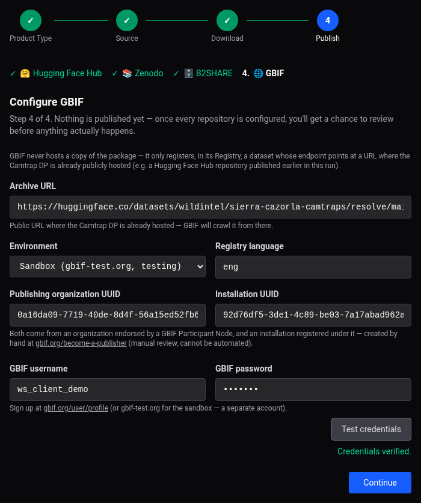

# Web App User Guide — GBIF

!!! note
    See [Publishing to GBIF](publishing-gbif.md) for what this repository is: unlike
    Hugging Face Hub, Zenodo, and B2SHARE, it never hosts a copy of the package — it only
    registers, in its Registry, a dataset whose endpoint points at a URL where the
    Camtrap DP is already publicly hosted. GBIF is **mandatory** for Camtrap DP in the
    wizard — pre-selected and not deselectable, so this configuration step always comes
    up; Hugging Face Hub stays optional alongside it, and always publishes first when
    both are selected (no manual reordering for this pair).

Every time you publish a Camtrap DP to GBIF, a page similar to this one appears, asking
you to fill in the following fields:

## Fields

- **Archive URL** — the public URL where the Camtrap DP is already hosted; GBIF will
  crawl it from there. **Must point to `camtrapdp-remote.zip`** — GBIF's `CAMTRAP_DP`
  crawler downloads whatever's at this URL and decompresses it itself, so a bare
  `datapackage.json` downloads fine but then fails to decompress, silently, with nothing
  ever crawled; `camtrapdp-local.zip` *is* a real zip, but its `media.csv` uses paths
  relative to a sibling `images/` folder, meaningless once GBIF extracts it in isolation.
  `camtrapdp-remote.zip` is built specifically for this — its `media.csv` already points at
  real Hugging Face Hub URLs, but it's only ever generated when Hugging Face Hub publishes
  in **Mirror** mode (never in Link mode). Two cases:
    - **Hugging Face Hub is also selected, publishing in Mirror mode**: this field is
      pre-filled *and locked* (read-only) to
      `https://huggingface.co/datasets/<repo>/resolve/main/camtrapdp-remote.zip`, derived
      from what you typed into the Hugging Face Hub form — there's no other valid value
      once both are selected together, so it can't be edited.
    - **Otherwise** (no Hugging Face Hub in this run, or it's publishing in Link mode):
      the field is empty and editable — type in the URL of a separate, already-public
      Camtrap DP archive yourself (e.g. hosted outside this tool, or from an earlier
      publish). Use **Validate archive** to check upfront that the URL really is a zip
      containing a valid Camtrap DP, before registering it with GBIF.
- **Environment** — **Sandbox** (`gbif-test.org`, testing — its own separate account) or
  **Production** (`gbif.org`).
- **Registry language** — ISO 639-2/T code the Registry API requires (defaults to
  `eng`).
- **Publishing organization UUID** / **Installation UUID** — both come from an
  organization endorsed by a GBIF Participant Node and an installation registered under
  it, created by hand at
  [gbif.org/become-a-publisher](https://www.gbif.org/become-a-publisher) (manual review,
  cannot be automated — see the [CLI User Guide](guide-cli.md#before-you-start) for the
  full process). Just want to smoke-test the sandbox first? GBIF's own shared demo
  organization/installation (shown filled in above) works with the demo login below.
- **GBIF username** / **GBIF password** — your gbif.org account (or gbif-test.org's, a
  separate account, for the sandbox). Sign up at
  [gbif.org/user/profile](https://www.gbif.org/user/profile). **Test credentials**
  verifies them immediately. Testing the sandbox only? GBIF publishes a shared demo
  login for exactly that — no signup needed: username `ws_client_demo`, password
  `Demo123` (pairs with the demo organization/installation above).

GBIF has no separate locking step — every registration (create or update) is immediately
live, so re-running it later (e.g. after publishing a new version elsewhere) is always
safe; it replaces the dataset's endpoint in place rather than creating a duplicate. There
is no "Sync" section for GBIF — `wildintel-publisher` never requests a DOI/PID from it,
and doesn't cross-reference one back into HFH's citation the way it does for Zenodo/
B2SHARE. (Some organizations have their own DataCite arrangement with GBIF that makes it
auto-assign a DOI on registration anyway — that's entirely GBIF/organization-side, not
something this tool controls or can predict.) See step 8 of the
[walkthrough](guide-web-camtrapdp.md#8-when-its-done) for where its registration shows up
once publishing finishes.
