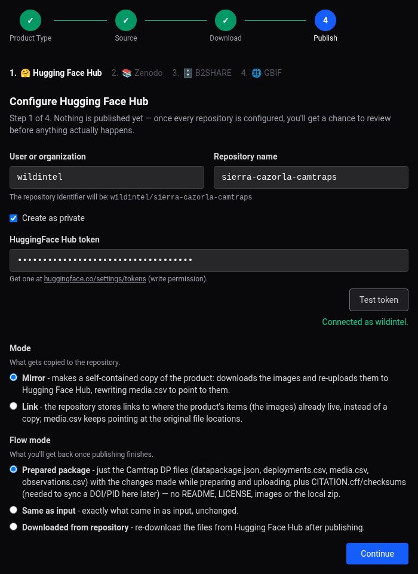

# Web App User Guide — Hugging Face Hub

!!! note
    See [Publishing to Hugging Face Hub](publishing-hfh.md) for what this repository is
    and what ends up stored there.

Every time you publish a product to Hugging Face Hub, a page similar to this one appears,
asking you to fill in the following fields:

## Fields

- **User or organization** / **Repository name** — together form the repository
  identifier (`user_or_org/dataset`). The user/organization is pre-filled from
  `settings.toml` if you've already published here before; the repository name is
  pre-filled from the product's own title, slugified — edit either as needed.
- **Create as private** — checked by default; the repository only becomes public once
  publishing finishes (see [Publishing Guide](publishing-guide.md)).
- **HuggingFace Hub token** — get one at
  [huggingface.co/settings/tokens](https://huggingface.co/settings/tokens) (write
  permission). Leave blank to reuse a previously saved token. **Test token** verifies it
  immediately, and — if the product's version was already published to this repository —
  warns you upfront, so you can bump `metadata.json`'s version before publishing again.
- **Mode** — **Mirror** (default) downloads the public images and re-uploads them here,
  rewriting `media.csv` to point to them (a fully self-contained copy). **Link** leaves
  `media.csv` pointing at the original file locations instead.
- **Flow mode** — what you get back once publishing finishes, only relevant if another
  repository comes after this one in the publish order: the **prepared** package (the
  core Camtrap DP files, default), the **same as input** unchanged, or a fresh copy
  **downloaded from** Hugging Face Hub itself.

Hugging Face Hub never has a DOI of its own — there's no "Sync DOI" section for it here;
it's the *destination* the Zenodo/B2SHARE sync sections write into instead (see
[Zenodo](guide-web-zenodo.md#sync-doi-to-hugging-face-hub)/
[B2SHARE](guide-web-b2share.md#sync-piddoi-to-hugging-face-hub)).
