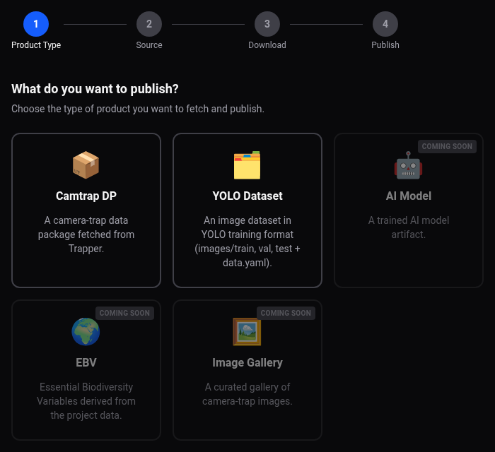
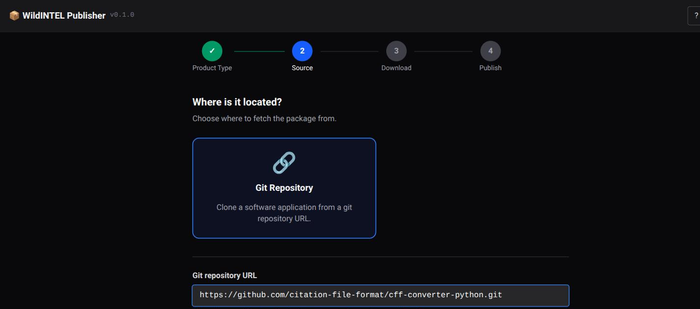
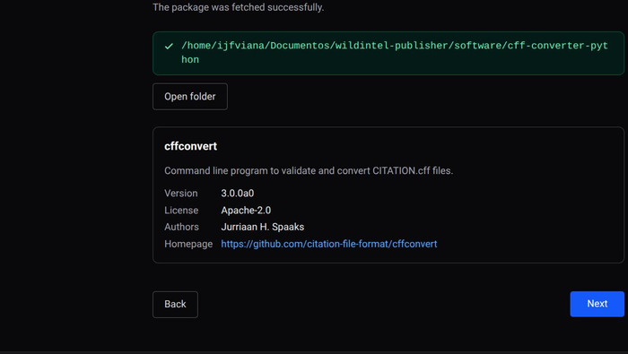
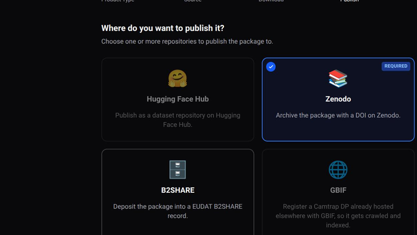
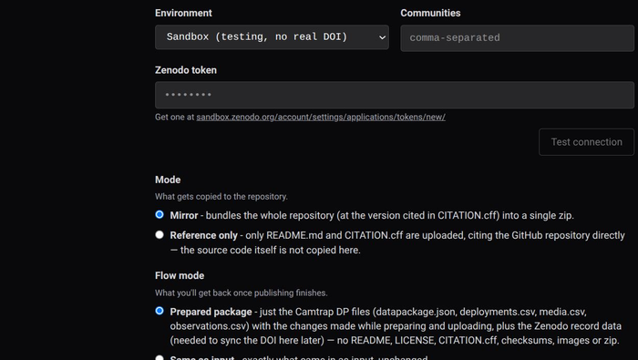

# Web App User Guide — Software Application

The `wildintel-publisher` web app makes it easy to publish a software application — a
step-by-step wizard, screen by screen, with no commands involved. See the [Publishing
Guide](publishing-guide.md) for the concepts referenced along the way (media modes,
locking, the generic pipeline), and [Software Application](product-software.md) for what
this product type actually is. Before starting, make sure every repository account you
plan to use is ready — see [Before you start](guide-web.md#before-you-start).

---

## 1. Choose what to publish

On the wizard's first screen, pick **Software Application**.

## 2. Choose where it comes from

Only **Git Repository** is offered — type the URL of the git repository to clone (e.g.
`https://github.com/user/repo.git`). Nothing is published yet at this point; the wizard
just clones a shallow copy locally to read its `CITATION.cff` and package it afterwards.

## 3. Confirm the package and its description

Once the clone finishes ("Package downloaded"), the wizard shows where it lives. Unlike
Camtrap DP/YOLO, the description comes entirely from the repository's own
[`CITATION.cff`](https://citation-file-format.github.io/) — see [Software
Application](product-software.md#2-raw-layout) for its required shape. If something
required (title, description, version, license, authors) is still missing, a form prompts
for exactly that; once complete, a summary card shows the title, version, license,
authors, and homepage.

Right after this step, the wizard also tries to switch the local clone to the git tag
matching `CITATION.cff`'s own `version` (`1.2.0`, then `v1.2.0`) — so what ends up
published matches the cited release rather than whatever commit happened to be on the
repository's default branch. If no matching tag exists, it silently proceeds with the
default branch's latest commit instead; nothing here blocks you from continuing either
way.

## 4. Choose repositories

Hugging Face Hub and GBIF are shown greyed out — a software application has no
media/biodiversity content, so neither is a fit for it (see [Software
Application](product-software.md#4-where-it-can-be-published)). Only **Zenodo** and
**B2SHARE** are actually selectable, and **Zenodo is mandatory** — pre-selected and not
deselectable, since its DOI is always the one used to cite the software; B2SHARE stays
optional alongside it. With no Hugging Face Hub in the picture, there's no publish order
to choose either.

## 5. Configure each selected repository

The wizard walks through your selected repositories one at a time, each with its own
configuration form — see [Zenodo](guide-web-zenodo.md)/[B2SHARE](guide-web-b2share.md)
for the full form, field-by-field. The **Mode** section reads a bit differently here than
in those pages' own screenshots (captured for Camtrap DP): for a software application it
reads **Mirror** ("bundles the whole repository, at the version cited in `CITATION.cff`,
into a single zip") and **Reference only** instead of Link ("only `README.md` and
`CITATION.cff` are uploaded, citing the repository directly — the source code itself is
not copied here"). Everything else about these forms (token, environment, communities/
community UUID, **Test connection**) works exactly the same.

There's no "primary DOI" question to answer here — that only comes up when Hugging Face
Hub, Zenodo, and B2SHARE are all selected together, which a software application never
reaches (no Hugging Face Hub, ever).

## 6. Confirm and publish

After a final summary screen, **Publish** runs the whole sequence on its own: uploading
to every selected repository, cross-referencing Zenodo's/B2SHARE's DOI/PID into each
other's `CITATION.cff` if both are selected, then locking each repository — with a single
live progress view showing every repository's status as it goes.

## 7. When it's done

The wizard confirms which repositories were published, but doesn't print each one's
resulting DOI/PID directly on this screen — check the repository itself, or the record
file its own output directory holds (`zenodo_record.json`, `b2share_record.json`). If
B2SHARE is still pending moderator review, that's shown too — its final PID/DOI won't be
known until a moderator approves the submission, which happens outside this wizard run.

This screen looks the same as [Camtrap DP's](guide-web-camtrapdp.md#7-when-its-done),
minus the Hugging Face Hub/GBIF entries in the "Published to" list (and, since there's no
Hugging Face Hub export to cross-reference into, no "Sync DOI"/"Sync PID" section either
— those only appear for a product type that also publishes there).
