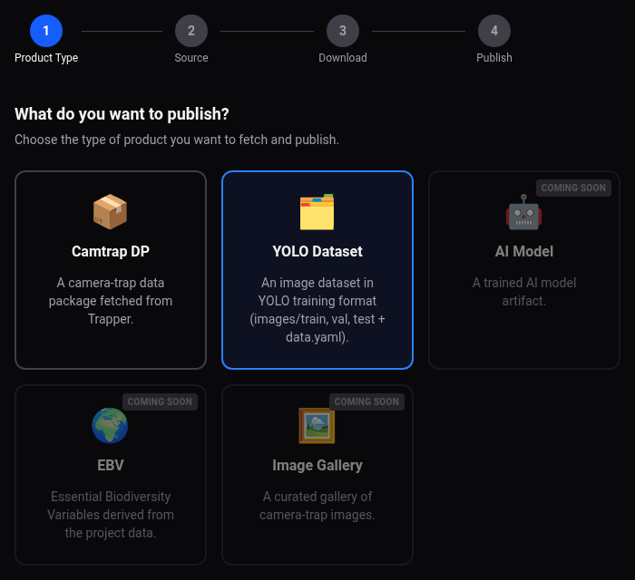
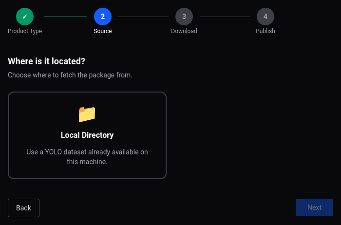
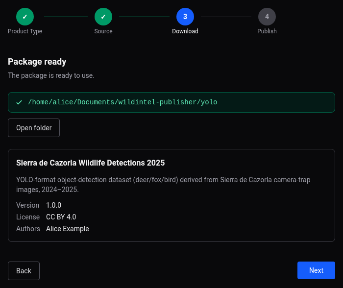

# Web App User Guide — AI Dataset

The `wildintel-publisher` web app makes it easy to publish an AI Dataset (a dataset in
YOLO training format) — a step-by-step wizard, screen by screen, with no commands
involved. See the [Publishing Guide](publishing-guide.md) for the concepts referenced
along the way (media modes, locking, the generic pipeline). Before starting, make sure
every repository account you plan to use is ready — see [Before you
start](guide-web.md#before-you-start).

---

## 1. Choose what to publish

On the wizard's first screen, pick **AI Dataset**.

## 2. Choose where it comes from

Only **Local Directory** is offered — a YOLO dataset is never fetched from Trapper, so
there's no equivalent of Camtrap DP's "Trapper Instance" source.

## 3. Confirm the package and its description

Once the wizard has read the local directory, it shows where it lives. If its common
description is missing something required (title, description, version, license,
authors), a form prompts for exactly what's missing; once complete, a summary card shows
the title, version, license, authors, and homepage.

## 4. Choose repositories and publish order

**Zenodo** is mandatory here — pre-selected and not deselectable, since its DOI is always
the one used to cite the dataset. **Hugging Face Hub** and **B2SHARE** stay optional
alongside it; GBIF isn't offered at all for this product type, see [Publishing to
GBIF](publishing-gbif.md#4-what-can-i-publish-here). If you add Hugging Face Hub and/or
B2SHARE on top of Zenodo, a **publish order** list lets you reorder them: the first
repository publishes the local dataset itself, and each next one publishes whatever the
previous one wrote to its own output — so, for example, publishing to Hugging Face Hub
before Zenodo lets Zenodo's record link back to it. A YOLO dataset's images always travel
together with `data.yaml` in self-contained/mirror mode — there's no external repository
for them to link to instead the way Camtrap DP can.

This is the same mandatory-repo mechanic used for [Software
Application](guide-web-software.md#4-choose-repositories) (Zenodo there too), just with
Hugging Face Hub and B2SHARE still available alongside it here.

## 5. Configure each selected repository

The wizard walks through your selected repositories one at a time, each with its own
configuration form — see that repository's own page for the full form, field-by-field,
with a screenshot: [Hugging Face Hub](guide-web-hfh.md), [Zenodo](guide-web-zenodo.md),
[B2SHARE](guide-web-b2share.md).

## 6. Choose the primary DOI (only if HFH, Zenodo and B2SHARE are all selected)

If Hugging Face Hub, Zenodo, and B2SHARE are all selected together, you're asked which
of Zenodo's or B2SHARE's DOI should be treated as *primary* in Hugging Face Hub's own
citation file — Hugging Face Hub never has a DOI of its own, so this only comes up when
there's more than one candidate to choose from.

## 7. Confirm and publish

After a final summary screen, **Publish** runs the whole sequence on its own: uploading
to every selected repository, cross-referencing whatever DOIs Zenodo/B2SHARE obtained
into each other's (and Hugging Face Hub's) citation file, then locking each repository —
with a single live progress view showing every repository's status as it goes.

## 8. When it's done

The wizard confirms which repositories were published, but doesn't print each one's
resulting URL/DOI/PID directly on this screen — check the repository itself, or the
record file its own output directory holds (`zenodo_record.json`, `b2share_record.json`).
If Zenodo and/or B2SHARE were published, you can also use the **Sync DOI**/**Sync PID**
sections shown here — besides reflecting the DOI/PID into an already-published Hugging
Face Hub export, they confirm success with a direct link back to it (see
[Zenodo](guide-web-zenodo.md#sync-doi-to-hugging-face-hub)/
[B2SHARE](guide-web-b2share.md#sync-piddoi-to-hugging-face-hub)). If B2SHARE is still
pending moderator review, that's shown too — its final PID/DOI won't be known until a
moderator approves the submission, which happens outside this wizard run.

This screen looks the same as [Camtrap DP's](guide-web-camtrapdp.md#7-when-its-done),
minus the GBIF entry in the "Published to" list.
