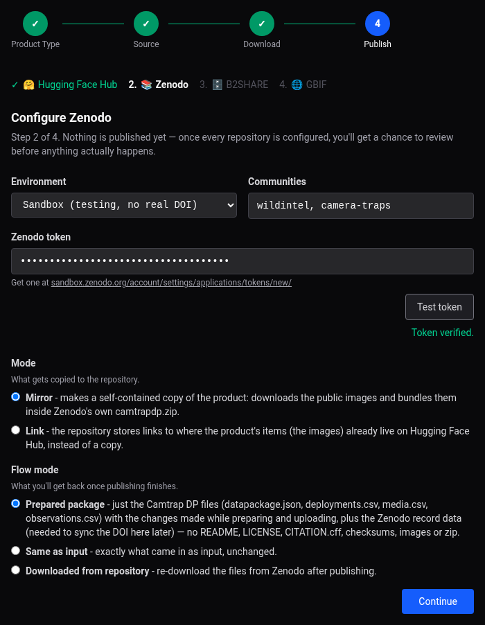
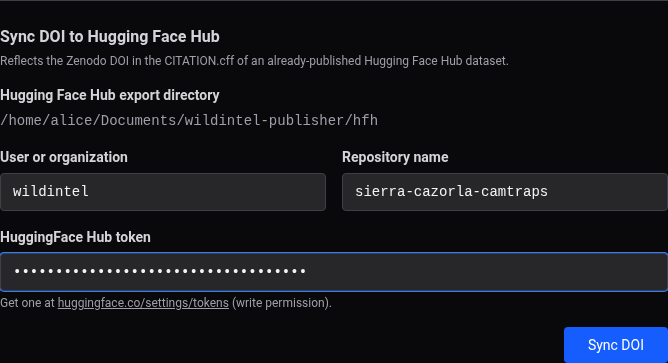
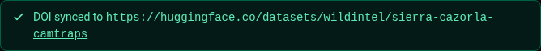

# Web App User Guide — Zenodo

!!! note
    See [Publishing to Zenodo](publishing-zenodo.md) for what this repository is and what
    ends up stored there.

Every time you publish a product to Zenodo, a page similar to this one appears, asking
you to fill in the following fields:

## Fields

- **Environment** — **Sandbox** (`sandbox.zenodo.org`, testing, no real DOI) or
  **Production** (`zenodo.org`).
- **Communities** — comma-separated Zenodo communities to submit the record to, if any.
- **Zenodo token** — get one at the URL shown under the field (varies with environment).
  Leave blank to reuse a previously saved token. **Test token** verifies it immediately.
- **Mode** — **Mirror** (default) downloads the public images and bundles them inside
  Zenodo's own `camtrapdp.zip` (self-contained). **Link** doesn't download anything — the
  repository stores links to where the images already live on Hugging Face Hub instead
  (only meaningful if Hugging Face Hub precedes Zenodo in the publish order).
- **Flow mode** — what you get back once publishing finishes, only relevant if another
  repository comes after this one in the publish order: the **prepared** package plus the
  Zenodo record data needed to sync the DOI later (default), the **same as input**
  unchanged, or a fresh copy **downloaded from** Zenodo itself.

Zenodo reserves its DOI *before* uploading, so it's already known by the time publishing
finishes — see step 8 of the [Camtrap DP](guide-web-camtrapdp.md#8-when-its-done) or
[YOLO Dataset](guide-web-yolo.md#8-when-its-done) walkthrough for how to see it.

## Sync DOI to Hugging Face Hub

If you publish Zenodo separately from Hugging Face Hub (a different wizard run, or later
after Hugging Face Hub was already published on its own), this section — shown on the
final "All done!" screen once Zenodo has published — reflects the Zenodo DOI into the
`CITATION.cff` of an *already-published* Hugging Face Hub export, and re-uploads just
that changed file (plus `checksums-sha256.txt`).

- **Hugging Face Hub export directory** — read-only, taken from `settings.toml`.
- **User or organization** — pre-filled from `settings.toml`, same as the Hugging Face
  Hub form itself.
- **Repository name** — **never pre-filled** — the dataset name is specific to each
  product, not something worth remembering globally, so type it in each time.
- **HuggingFace Hub token** — leave blank to reuse a previously saved one.

Once synced, it confirms with a direct link to the Hugging Face Hub dataset:

This is the web equivalent of the CLI's `zenodo sync-doi` — except the CLI only edits the
local `CITATION.cff` and tells you to re-run `hfh upload` yourself; here the re-upload
happens automatically.
