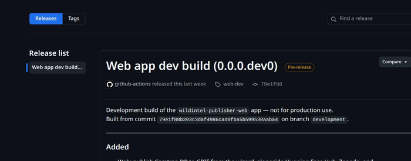
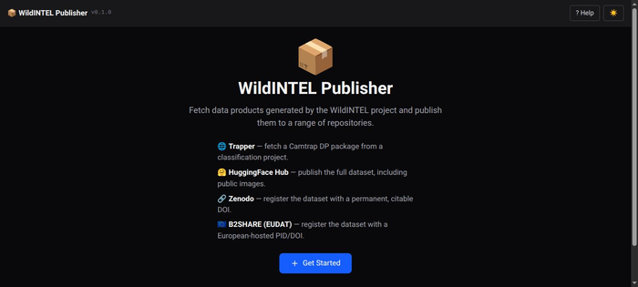

# Web App User Guide

A step-by-step walkthrough of publishing each product type to every repository using the
web app's wizard — screen by screen, with no commands involved. See the [Publishing
Guide](publishing-guide.md) for the concepts referenced along the way (media modes,
locking, the generic pipeline), and each repository's own "What can I publish here?" page
for exactly what ends up stored.

For the same walkthrough using the command line instead, see the
[CLI User Guide](guide-cli.md).

---

## Getting the web app

Prebuilt binaries — no Python or Node installation required.

1. Go to the [Releases page](https://github.com/wildintelproject/wildintel-publisher/releases)
   and pick the latest stable release (or the `web-dev` pre-release for the latest
   development build).

   

2. Download the asset for your OS:
   - **Linux**: `wildintel-publisher-web-X.Y.Z-linux-x86_64`
   - **macOS** (Apple Silicon): `wildintel-publisher-web-X.Y.Z-macos-arm64`
   - **Windows**: `wildintel-publisher-web-X.Y.Z-windows-x64.exe`
3. Run it.

   Linux/macOS — make it executable first:

   <div class="termy">

   ```console
   $ chmod +x wildintel-publisher-web-X.Y.Z-linux-x86_64
   $ ./wildintel-publisher-web-X.Y.Z-linux-x86_64
   // Starts a local server and opens your default browser automatically
   ```

   </div>

   Windows — run it from a terminal (or double-click):
   ```powershell
   .\wildintel-publisher-web-X.Y.Z-windows-x64.exe
   ```

It starts a local server and opens your default browser automatically (falling back to
the next free port if its default one is busy) — no separate step needed.



---

## Before you start

Before you can publish anything, the repositories you plan to use need a correctly
configured, working account — the wizard's own configuration forms (step 5 of each
walkthrough) are where you enter tokens/IDs, so there's no separate config-file setup
step, but you do need each account itself ready beforehand. To see exactly what's needed
for a given repository (access tokens, IDs, and anything else its form will ask for),
click through to its page:

- [Hugging Face Hub](guide-web-hfh.md)
- [Zenodo](guide-web-zenodo.md)
- [B2SHARE](guide-web-b2share.md)
- [GBIF](guide-web-gbif.md)

If you've already saved any tokens via the CLI's `config set` commands, the wizard
pre-fills its forms with those same saved values.

---

## Select what you want to publish

On the wizard's first screen, pick what you want to publish. Currently we can publish:

- **[Camtrap DP](guide-web-camtrapdp.md)** — a camera-trap package, fetched from a
  Trapper classification project or already available locally, to Hugging Face Hub
  and/or GBIF (the wizard's own repository choice for this product type — Zenodo/B2SHARE
  stay available for it via the CLI). GBIF is mandatory here.
- **[YOLO Dataset](guide-web-yolo.md)** — a local YOLO training dataset, to Hugging Face
  Hub, Zenodo, and/or B2SHARE (Zenodo is mandatory here).
- **[Software Application](guide-web-software.md)** — a git repository, to Zenodo
  and/or B2SHARE (Zenodo is mandatory here).
- **AI Model** *(coming soon)* — a trained AI model artifact.
- **EBV** *(coming soon)* — Essential Biodiversity Variables derived from the project
  data.
- **Image Gallery** *(coming soon)* — a curated gallery of camera-trap images.

Each of the first three links above walks through the wizard for that product, screen by
screen, with screenshots — the rest are shown on this screen but aren't selectable yet.
