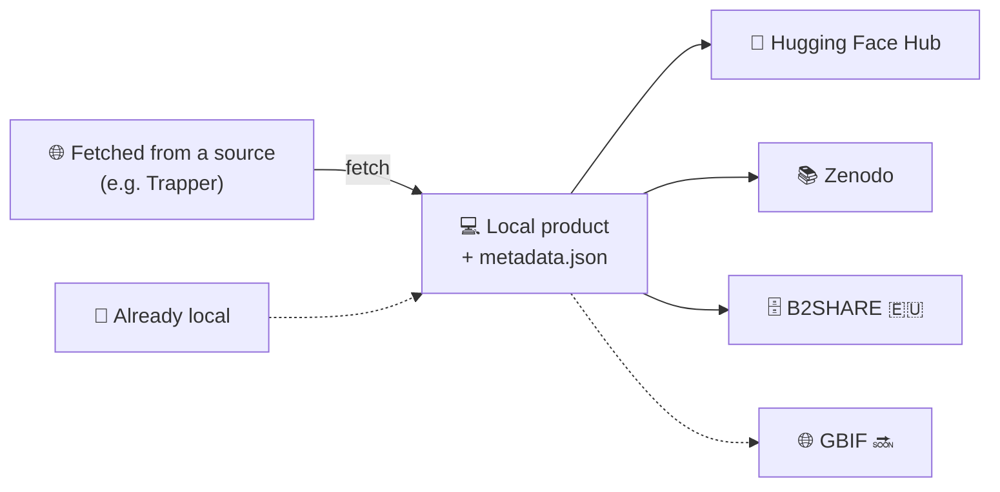

# Publishing Guide

This document explains the general publishing process this project follows, regardless
of which product type or repository you're publishing to. It is aimed at whoever is
running the CLI or the web app to fetch and publish a product.

---

## Overview

`wildintel-publisher` takes a [product](products.md) — whatever it fetches or is
pointed at — and publishes it to one or more external repositories, each serving a
different community:

- **[Hugging Face Hub](publishing-hfh.md)** — the platform the AI/ML community actually
  works with day to day. It's the one repository here that hosts the media itself by
  default, with no DOI of its own — built for hosting and versioning data, not for
  formal citation.
- **[Zenodo](publishing-zenodo.md)** — a citable, permanent-DOI record for the scientific
  community, run by CERN. It can either host a full self-contained copy of the media or
  just a citable metadata record linking back to wherever the media actually lives
  (typically Hugging Face Hub).
- **[B2SHARE (EUDAT)](publishing-b2share.md)** 🇪🇺 — the European counterpart to Zenodo,
  for the EU scientific community. Same linked/self-contained choice as Zenodo, with
  community submission and moderator review built in.
- **[GBIF](https://www.gbif.org/)** 🔜 — the global biodiversity data network; planned as
  a future repository, for Camtrap DP only (see [Products](products.md#where-products-can-be-published)).

---

## The generic pipeline

Every product/repository combination goes through the same shape:

1. **Obtain the raw product.** Fetched from a source (Trapper, for Camtrap DP) or
   simply already sitting on disk (YOLO) — see [Camtrap DP](product-camtrapdp.md) /
   [YOLO](product-yolo.md) for what's expected in each case.
2. **Describe it.** The product is validated and given the common description every
   product type carries — title, description, version, license, authors, homepage (see
   [Products](products.md#supported-product-types)). Every later phase
   reads this description, never the raw product's own metadata directly, which is why
   every repository ends up with identical title/description/license/authors.
3. **Build the export.** A fresh copy of the product is prepared for a specific
   repository and product according to the chosen [publishing mode](#publishing-modes), and
   that repository's own documentation (a description page, a machine-readable citation
   file, a license file, a checksums manifest) is generated on top.
4. **Push it.** The prepared export is sent to the repository, creating it — or the
   underlying draft/deposition — the first time, and updating it on any later run.
5. **Lock it.** What exactly this means differs by repository — see
   [Locking a publish](#locking-a-publish) below.
6. **Cross-reference DOIs, if applicable** (optional) — an already-obtained DOI/PID from
   one repository can be copied into an existing Hugging Face Hub export's citation
   file, so all your citable identifiers end up cross-referenced rather than scattered
   across repositories that don't know about each other.

!!! note "Not every DOI is obtained the same way"
    Most of the repositories in this project can provide a DOI, but not all of them
    obtain it the same way: some generate it automatically as part of the publishing
    process itself, while others need it requested manually ahead of time, before
    publishing can happen at all.

## Publishing modes

Every repository's export can be built in one of two modes:

- **Mirror** — the export tries to be self-contained. Wherever the product references
  something that lives outside it — typically images hosted somewhere else — that
  reference is resolved and the file itself is downloaded/copied into the export,
  rather than left as just a pointer.
- **Link** — the export is not self-contained. Whatever it references outside itself
  stays exactly that: a reference (typically a URL pointing at an existing Hugging Face
  Hub copy) — nothing extra is downloaded or copied in.

For Camtrap DP, mirror downloads every public image and either uploads them
individually (Hugging Face Hub) or bundles them into a single zip (Zenodo/B2SHARE —
also needed because [B2SHARE caps a record at 100 files](publishing-b2share.md#2-main-characteristics)),
rewriting `media.csv`'s media references accordingly; link instead rewrites those same
references to point at an existing Hugging Face Hub copy, without downloading anything.
For YOLO, mirror always copies the whole `images/` tree — it's already local, so
there's nothing to resolve — while link leaves the images out of that particular
export, since YOLO has no external host its images could already point to instead.

## What you get back locally

Once a repository finishes publishing, its own local output can be one of three
things — this mainly matters when chaining more than one repository, since each next
one uses whatever the previous left behind as its own input:

- **Unmodified** — the original product, exactly as it came in, untouched. Nothing new
  is written to this output.
- **Modified** — the product's own files with whatever changed while preparing and
  uploading it — for example, image references rewritten to point at wherever they
  actually ended up published, in a mirror-mode publish — without the extra files
  (documentation, images, a local zip) meant only for that one repository.
- **Exactly what was uploaded** — a fresh copy fetched back from the repository itself,
  verifying that what's now live there truly matches what was meant to be published.

!!! note "This choice matters when publishing to more than one repository"
    Understanding this behavior is important: publishing to multiple repositories works
    like a pipe, where the output of one repository becomes the input of the next. What
    you choose to get back here directly determines what the next repository in the
    sequence actually receives to work with.

## Locking a publish

Locking means something different per repository — read the relevant guide before
relying on it being (or not being) reversible:

- **[Hugging Face Hub](publishing-hfh.md)** — tags the uploaded commit with the
  product's version (refusing to re-tag a version that's already published) and makes
  the repository public. The repository itself stays a normal, mutable git repo
  forever; only that specific version's tag is protected against being silently
  overwritten.
- **[Zenodo](publishing-zenodo.md)** — publishes the deposition for real, assigning its
  final DOI. This is **irreversible**: a published Zenodo version's files can never be
  edited or removed again — only a new version (a new DOI) can supersede it.
- **[B2SHARE](publishing-b2share.md)** — only *submits* the draft for review by a
  moderator of the EUDAT community — it does not publish it by itself. The record only
  actually becomes public (and gets its PID/DOI, if one wasn't already reserved ahead
  of time) once a moderator approves it, which can take a while and isn't guaranteed to
  happen at all.
- **[GBIF](https://www.gbif.org/)** 🔜 — coming soon.

## Two ways to publish

- **[CLI User Guide](guide-cli.md)** — each repository's `prepare`/`upload`/`release`
  (plus `sync-doi`/`sync-pid`) are run one at a time, by hand, in the order you choose.
  Only Hugging Face Hub has a combined `pipeline` command (`prepare → upload → release`
  in one call); Zenodo and B2SHARE have no such shortcut — run their three commands in
  sequence yourself.
- **[Web App User Guide](guide-web.md)** — a wizard-driven UI covering the same product
  types and repositories. Selecting more than one repository publishes them
  automatically, one after another, and — uniquely to the web app — cross-references
  whatever DOI Zenodo/B2SHARE each managed to reserve into the *other's* `CITATION.cff`
  before either one locks, asking you which one Hugging Face Hub should treat as
  primary if all three repositories are selected together. This cross-repository DOI
  reflection isn't available from the CLI; the CLI's own `sync-doi`/`sync-pid` commands
  only ever push a DOI/PID one way, into a Hugging Face Hub export, and only after the
  source repository has already published.

Each guide has a section per product type, with the exact steps to publish it to every
repository.
